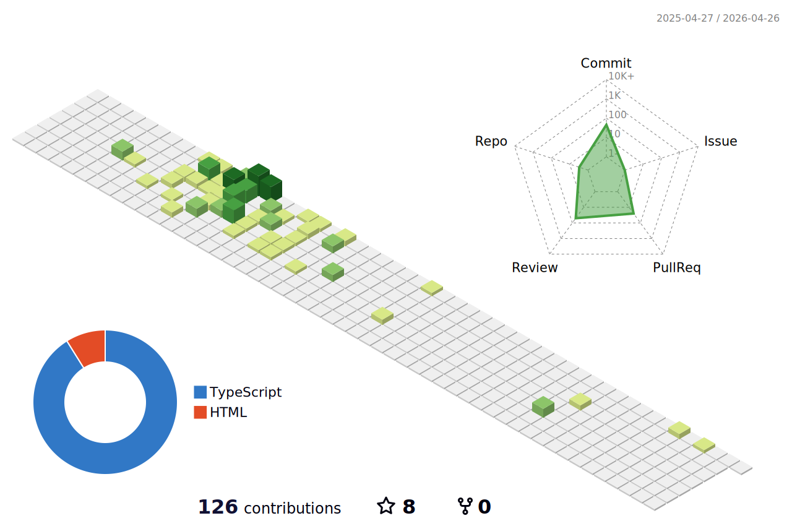

## Hi there! 👋

  

I'm **Daniel** and I'm a team leader and a backend software developer.

My interests:

⚡ NodeJS

☑️ Testing techniques and best practices

🌍 Geospatiality

🧠 Event driven architectures

## Packages
Check out my first npm package: [slack-emojis](https://www.npmjs.com/package/slack-emojis)

## Recent Acitivty
<!--START_SECTION:activity-->
1. ❌ Closed PR [#15](https://github.com/MapColonies/cosmocrat-cli-dockerized/pull/15) in [MapColonies/cosmocrat-cli-dockerized](https://github.com/MapColonies/cosmocrat-cli-dockerized)
2. ❌ Closed PR [#16](https://github.com/MapColonies/cosmocrat-cli-dockerized/pull/16) in [MapColonies/cosmocrat-cli-dockerized](https://github.com/MapColonies/cosmocrat-cli-dockerized)
3. 🎉 Merged PR [#10](https://github.com/MapColonies/osm2pgsql-wrapper/pull/10) in [MapColonies/osm2pgsql-wrapper](https://github.com/MapColonies/osm2pgsql-wrapper)
4. 🎉 Merged PR [#19](https://github.com/MapColonies/retiler/pull/19) in [MapColonies/retiler](https://github.com/MapColonies/retiler)
5. 🎉 Merged PR [#49](https://github.com/MapColonies/osm-sync-tracker/pull/49) in [MapColonies/osm-sync-tracker](https://github.com/MapColonies/osm-sync-tracker)
<!--END_SECTION:activity-->

