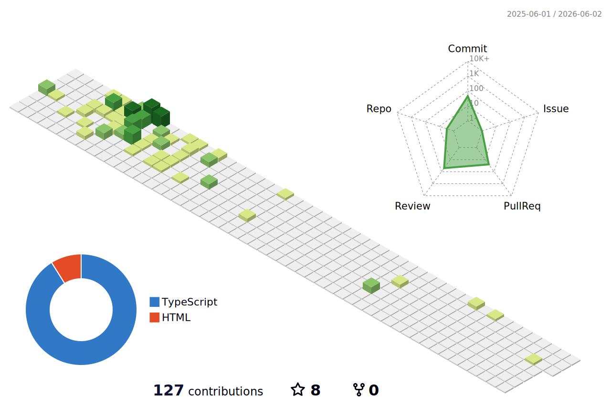

## Hi there! 👋

  

I'm **Daniel** and I'm a team leader and a backend software developer.

My interests:

⚡ NodeJS

☑️ Testing techniques and best practices

🌍 Geospatiality

🧠 Event driven architectures

## Packages
Check out my first npm package: [slack-emojis](https://www.npmjs.com/package/slack-emojis)

## Recent Acitivty
<!--START_SECTION:activity-->
1. ❌ Closed PR [#81](https://github.com/MapColonies/mc-utils/pull/81) in [MapColonies/mc-utils](https://github.com/MapColonies/mc-utils)
2. ❌ Closed PR [#80](https://github.com/MapColonies/mc-utils/pull/80) in [MapColonies/mc-utils](https://github.com/MapColonies/mc-utils)
3. ❌ Closed PR [#76](https://github.com/MapColonies/mc-utils/pull/76) in [MapColonies/mc-utils](https://github.com/MapColonies/mc-utils)
4. ❌ Closed PR [#79](https://github.com/MapColonies/mc-utils/pull/79) in [MapColonies/mc-utils](https://github.com/MapColonies/mc-utils)
5. ❌ Closed PR [#78](https://github.com/MapColonies/mc-utils/pull/78) in [MapColonies/mc-utils](https://github.com/MapColonies/mc-utils)
<!--END_SECTION:activity-->

