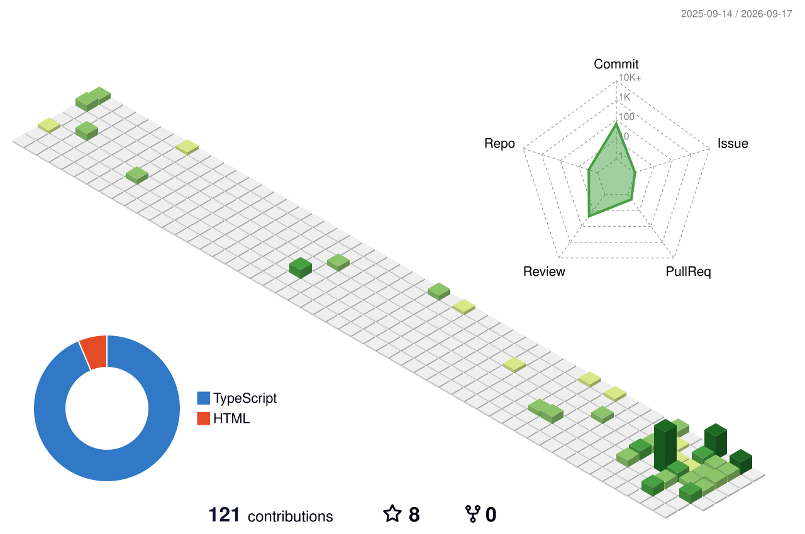

## Hi there! 👋

  

I'm **Daniel** and I'm a team leader and a backend software developer.

My interests:

⚡ NodeJS

☑️ Testing techniques and best practices

🌍 Geospatiality

🧠 Event driven architectures

## Packages
Check out my first npm package: [slack-emojis](https://www.npmjs.com/package/slack-emojis)

## Recent Acitivty
<!--START_SECTION:activity-->
1. 🚀 Published release [v1.0.6 - Dynamic Auto-Discovery & Pipeline Selection](https://github.com/MapColonies/metatile-queue-populator-ui/releases/tag/v1.0.6) in [MapColonies/metatile-queue-populator-ui](https://github.com/MapColonies/metatile-queue-populator-ui)
2. 🚀 Published release [v1.0.0 - Production Release](https://github.com/MapColonies/metatile-queue-populator-ui/releases/tag/v1.0.0) in [MapColonies/metatile-queue-populator-ui](https://github.com/MapColonies/metatile-queue-populator-ui)
3. 🗣 Commented on [#59](https://github.com/MapColonies/nginx/pull/59#issuecomment-5307561112) in [MapColonies/nginx](https://github.com/MapColonies/nginx)
4. ❌ Closed PR [#79](https://github.com/MapColonies/mc-utils/pull/79) in [MapColonies/mc-utils](https://github.com/MapColonies/mc-utils)
5. ❌ Closed PR [#78](https://github.com/MapColonies/mc-utils/pull/78) in [MapColonies/mc-utils](https://github.com/MapColonies/mc-utils)
<!--END_SECTION:activity-->

