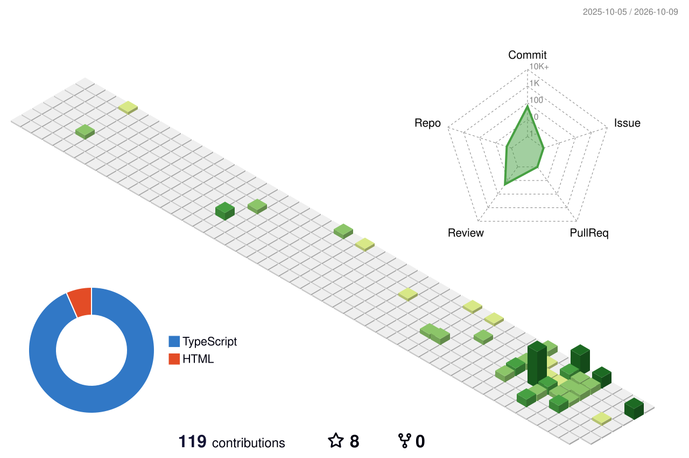

## Hi there! 👋

  

I'm **Daniel** and I'm a team leader and a backend software developer.

My interests:

⚡ NodeJS

☑️ Testing techniques and best practices

🌍 Geospatiality

🧠 Event driven architectures

## Packages
Check out my first npm package: [slack-emojis](https://www.npmjs.com/package/slack-emojis)

## Recent Acitivty
<!--START_SECTION:activity-->
1. 🗣 Commented on [#7](https://github.com/MapColonies/geoserver/pull/7#issuecomment-6055357775) in [MapColonies/geoserver](https://github.com/MapColonies/geoserver)
2. 🗣 Commented on [#101](https://github.com/MapColonies/docker-mapproxy/pull/101#issuecomment-5990541821) in [MapColonies/docker-mapproxy](https://github.com/MapColonies/docker-mapproxy)
3. 🗣 Commented on [#6](https://github.com/MapColonies/geoserver/pull/6#issuecomment-5927996559) in [MapColonies/geoserver](https://github.com/MapColonies/geoserver)
4. 🚀 Published release [v1.0.6 - Dynamic Auto-Discovery & Pipeline Selection](https://github.com/MapColonies/metatile-queue-populator-ui/releases/tag/v1.0.6) in [MapColonies/metatile-queue-populator-ui](https://github.com/MapColonies/metatile-queue-populator-ui)
5. ❌ Closed PR [#78](https://github.com/MapColonies/mc-utils/pull/78) in [MapColonies/mc-utils](https://github.com/MapColonies/mc-utils)
<!--END_SECTION:activity-->

