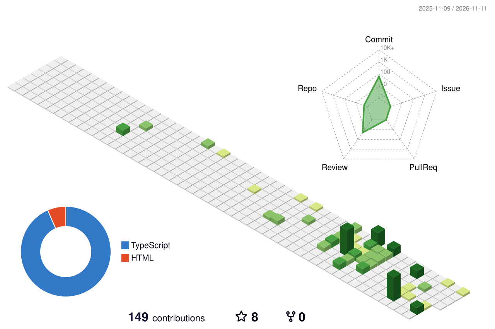

## Hi there! 👋

  

I'm **Daniel** and I'm a team leader and a backend software developer.

My interests:

⚡ NodeJS

☑️ Testing techniques and best practices

🌍 Geospatiality

🧠 Event driven architectures

## Packages
Check out my first npm package: [slack-emojis](https://www.npmjs.com/package/slack-emojis)

## Recent Acitivty
<!--START_SECTION:activity-->
1. 🗣 Commented on [#8](https://github.com/MapColonies/geoserver/pull/8#issuecomment-6766593959) in [MapColonies/geoserver](https://github.com/MapColonies/geoserver)
2. ❌ Closed PR [#174](https://github.com/MapColonies/opa-la/pull/174) in [MapColonies/opa-la](https://github.com/MapColonies/opa-la)
3. 🗣 Commented on [#13](https://github.com/falocity/CatalogEx/pull/13#issuecomment-6410626899) in [falocity/CatalogEx](https://github.com/falocity/CatalogEx)
4. 🗣 Commented on [#174](https://github.com/MapColonies/developer-portal/pull/174#issuecomment-6109157697) in [MapColonies/developer-portal](https://github.com/MapColonies/developer-portal)
5. 🗣 Commented on [#6](https://github.com/MapColonies/geoserver/pull/6#issuecomment-5927996559) in [MapColonies/geoserver](https://github.com/MapColonies/geoserver)
<!--END_SECTION:activity-->

