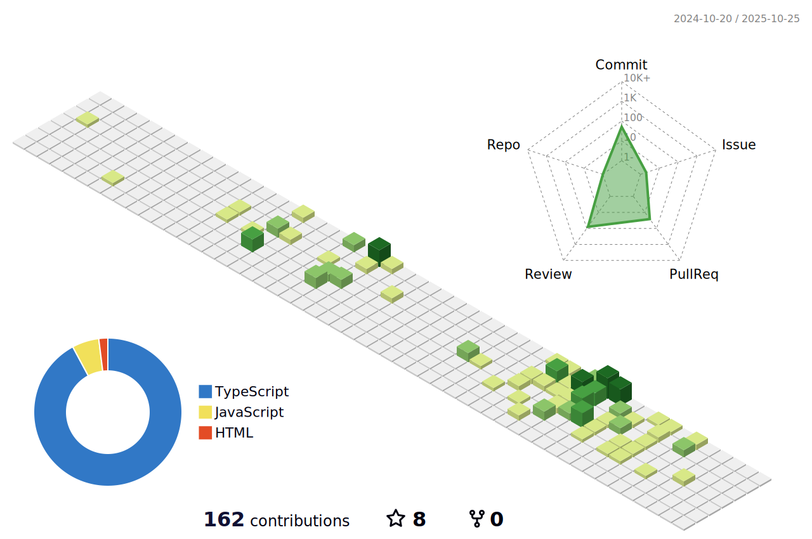

## Hi there! 👋

  

I'm **Daniel** and I'm a team leader and a backend software developer.

My interests:

⚡ NodeJS

☑️ Testing techniques and best practices

🌍 Geospatiality

🧠 Event driven architectures

## Packages
Check out my first npm package: [slack-emojis](https://www.npmjs.com/package/slack-emojis)

## Recent Acitivty
<!--START_SECTION:activity-->
1. 🎉 Merged PR [#7](https://github.com/MapColonies/replica-server/pull/7) in [MapColonies/replica-server](https://github.com/MapColonies/replica-server)
2. 🎉 Merged PR [#6](https://github.com/MapColonies/replica-server/pull/6) in [MapColonies/replica-server](https://github.com/MapColonies/replica-server)
3. 💪 Opened PR [#16](https://github.com/MapColonies/cosmocrat-cli-dockerized/pull/16) in [MapColonies/cosmocrat-cli-dockerized](https://github.com/MapColonies/cosmocrat-cli-dockerized)
4. 🎉 Merged PR [#83](https://github.com/MapColonies/change-merger/pull/83) in [MapColonies/change-merger](https://github.com/MapColonies/change-merger)
5. 🎉 Merged PR [#79](https://github.com/MapColonies/change-merger/pull/79) in [MapColonies/change-merger](https://github.com/MapColonies/change-merger)
<!--END_SECTION:activity-->

